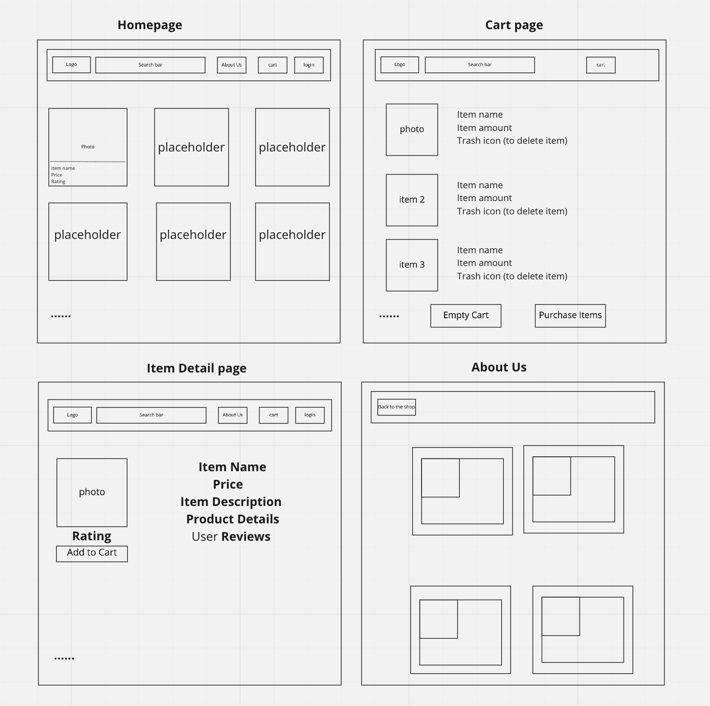

# Insta Dealz Back-end

**Contributor**: Arthur Lozano Jr, Brandon Mizutani, David Waiganjo, Wenhao Piao

### Project idea

### [Project management](https://github.com/orgs/Team-PythonGo/projects/1)

### Wire Frame

### Customization Steps for Django Rest Framework

- DO NOT migrate yet
- add additional dependencies as needed
  - Re-export requirements.txt as needed
- change `things` folder to the app name of your choice
- Search through entire code base for `Thing`,`Things` and `things` to modify code to use your resource
  - `project/settings.py`
  - `project/urls.py`
  - App's files
    - `views.py`
    - `urls.py`
    - `admin.py`
    - `serializers.py`
    - `permissions.py`
- Update ThingModel with fields you need
  - Make sure to update other modules that would be affected by Model customizations. E.g. serializers, tests, etc.
- Rename `project/.env.sample` to `.env` and update as needed
- Run makemigrations and migrate commands
- Optional: Update `api_tester.py`
